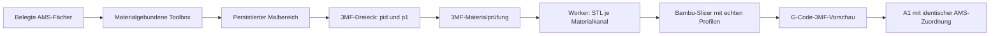

# V6 – Malwerkzeuge und Mehrfarben-Vertrag

Stand: 25.09.2026

## Zweck

Eine im Studio sichtbare Bemalung darf nur dann als Mehrfarbdruck verwendet werden, wenn die gesamte Kette von der Auswahl bis zum A1 nachweisbar dieselben echten Materialien verwendet. Eine reine Bildschirmfarbe ist kein Druckvertrag.

## Verbindliche Materialregeln

1. Die Werkzeugleiste bietet ausschließlich tatsächlich belegte AMS-Lite-Materialien an. Farbe, Name und Materialkennung stammen aus dem geladenen Fach.
2. Freie RGB-Eingaben sind für druckbare Bemalungen unzulässig.
3. Die externe Einzelspule ist ein einzelner Materialkanal. Sie darf nicht still als AMS-Ersatz verwendet werden und sperrt Mehrfarben-Bemalung.
4. Jede Fläche speichert Ursprungsobjekt, Dreiecksnummern, sichtbare Farbe und die eindeutige Materialkennung.
5. Die Objektliste bleibt für importierte Modelle unverändert. Bemalungen erscheinen getrennt unter **Malbereich**.

## Technischer Vertrag

- Der 3MF-Export schreibt die Materialzuordnung pro bemaltem Dreieck.
- Die 3MF-Prüfung akzeptiert nur Referenzen auf tatsächlich übergebene aktive Filamente.
- Der native Worker liest die Dreieckszuordnung und erzeugt getrennte STL-Teile pro Materialkanal für den Bambu-Assembler.
- Unbekannte, negative oder nicht aktive Materialindizes werden vor dem Slicer abgewiesen.
- Unterschiedliche Materialwerte innerhalb eines Dreiecks (Farbverlauf) sind für den Druck nicht unterstützt und werden abgewiesen.

## Bereitstellungsregel für den nativen Worker

Der Home-Assistant-Frontend-/Komponenten-Deploy aktualisiert den nativen Slicer-Worker nicht automatisch. Für Worker-Änderungen sind zwingend:

1. geprüfter Quellstand inklusive Worker-Abhängigkeits-Prüfsummen,
2. kontrollierter Zugriff auf das tatsächliche Worker-System,
3. Prüfung auf keine aktive oder wartende Slice-Arbeit,
4. Same-Day-Backup,
5. atomarer Dateiaustausch,
6. Neustart ausschließlich des Slicer-Dienstes,
7. Live-SHA- und API-/Telemetrieprüfung.

Ohne diesen getrennten Deploy-Schritt darf nicht behauptet werden, dass die sichtbare Bemalung bereits am Drucker ankommt.

## Qualitäts- und Freigabekette

- Source-Policy: keine DOM-, Prototype-, Monkey- oder Runtime-Patches.
- TypeScript, Frontend-Logiktests und Produktionsbuild müssen erfolgreich sein.
- Python-Syntax, Importe, Worker- und Regressionstests müssen erfolgreich sein.
- Bereitstellung nur mit Backup, SHA-256 und Rückrollmöglichkeit.
- Connector-HTTP-504 bewertet nicht den Lauf; die Resultatdateien und Live-SHAs sind maßgeblich.
- Ein Test-Slice ist kein Druckstart. Nach dem Slice werden zuerst G-Code-3MF, Materialvorschau, Materialkanäle, Düse und Platte geprüft.
- Erst danach kann ein Druck separat und ausdrücklich freigegeben werden.

## Abnahme des ersten realen Mehrfarbenfalls

1. Kleines Modell mit zwei eindeutig unterschiedlichen belegten AMS-Fächern wählen.
2. Zwei getrennte Malbereiche erzeugen und Studio neu laden; beide Flächen müssen erhalten bleiben.
3. Kontrolliert slicen, aber nicht drucken.
4. Vorschau und Materialkanäle gegen Studio und die physischen AMS-Fächer abgleichen.
5. Erst bei vollständiger Übereinstimmung ist ein separater Druckstart zulässig.

## Prüfstand vom 25.09.2026

Der Quellvertrag wurde mit 133 Frontend-Tests sowie 519 Python-Tests und 3 Subtests geprüft. Der offene Nachweis ist ausschließlich die separate Bereitstellung auf dem tatsächlichen nativen Worker und der danach bewusst manuell freizugebende Test-Slice. Kein Druckauftrag gehört zu dieser Quellprüfung.

## Feinmalraster und Formwerkzeuge

- Ein importiertes STL/3MF besitzt oft grobe Dreiecke. Ein Pinsel, Kreis oder Rechteck darf deshalb nicht allein ganze Originaldreiecke einfärben, wenn der sichtbare Auftrag nur einen Teil der Oberfläche trifft.
- Vor dem Materialauftrag werden ausschließlich die vom Werkzeug berührten Flächen adaptiv in exportierbare Unterdreiecke mit drucknaher Kantenlänge unterteilt. Bereits vorhandene AMS-Materialzuweisungen werden vollständig auf die neuen Dreiecke abgebildet.
- Erst nach dieser Verfeinerung wird Pinsel, Stift, Kreis oder Rechteck gegen die Oberfläche ausgewertet. Dadurch bleibt die sichtbare Fläche identisch mit den 3MF-Materialreferenzen und kann über den bestehenden Worker-Vertrag in echte Materialteile überführt werden.
- Kreis und Rechteck zeigen während des Ziehens einen glatten Aufziehrahmen über dem WebGL-Viewport. Dieser Rahmen ist nur die Eingabevorschau; maßgeblich für den Druck sind ausschließlich die daraus erzeugten Unterdreiecke und ihre AMS-Materialkennung.
- Die Unterteilung, Materialzuordnung und Malbereichseinträge müssen persistieren sowie Rückgängig/Wiederholen unterstützen. Slicing bleibt fail-closed, wenn eine verfeinerte Fläche keinem aktuell belegten AMS-Kanal zugeordnet ist.
